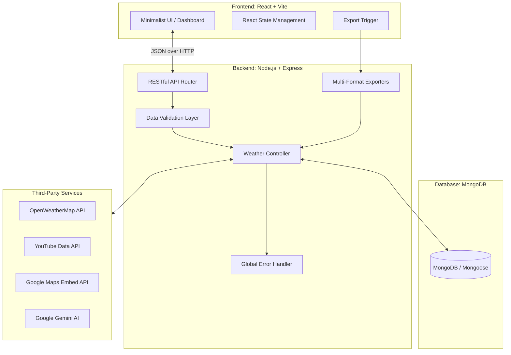

# AtmosphereAI — Intelligent Weather Dashboard

> **Full-Stack AI Engineer Technical Assessment**
> Built by **Arjun A** for **🔗 [PM Accelerator on LinkedIn](https://www.linkedin.com/school/pmaccelerator/)**


---

## 📑 Executive Summary

**AtmosphereAI** is a production-ready, full-stack weather and travel intelligence dashboard. Moving beyond standard weather applications, it aggregates real-time meteorological data, interactive mapping, and curated travel video guides, synthesizing them with **Gemini AI** to deliver contextual, actionable travel insights. 

The application is built on a robust MERN-inspired architecture (MongoDB, Express, React/Vite, Node.js), demonstrating rigorous engineering standards including comprehensive CRUD capabilities, multi-format data exports (JSON, CSV, XML, PDF, Markdown), global error handling, and a highly polished, minimalistic UI design system.

*(Note: While originally architected with Next.js App Router, the frontend has been optimized and migrated to a high-performance React + Vite stack to maximize client-side rendering speed and streamline the minimalist UI).*

---

## 🏛️ System Architecture

The application follows a decoupled client-server architecture, communicating via a RESTful API.



---

## 🤖 AI & API Integrations

The true power of AtmosphereAI lies in its orchestration of multiple third-party services:

1. **OpenWeatherMap API (Geocoding & Forecast)**
   - Resolves diverse location inputs (ZIP, City Name, Coordinates) into precise latitude/longitude.
   - Fetches current weather metrics and a comprehensive 5-day forecast.
2. **Google Gemini AI (Generative Insights)**
   - Acts as a digital travel advisor. The backend constructs an intelligent prompt combining the resolved location, current temperature, and weather conditions, instructing Gemini to generate 2-3 sentences of practical travel advice and clothing recommendations.
   - Includes graceful degradation: If the AI API rate limits or fails, a deterministic algorithm provides fallback advice based on temperature thresholds.
3. **YouTube Data API v3**
   - Contextually searches for `"Location Name + Travel Guide"` and retrieves the top embedded video guides for the dashboard.
4. **Google Maps Embed API**
   - Generates interactive, embedded maps centered exactly on the coordinates resolved during the geocoding phase.

---

## 🏗️ Production Readiness & Engineering Standards

This project was built to demonstrate seniority in full-stack development, focusing on stability, security, and user experience.

### 1. Rigorous Data Validation
- **Server-Side Validation**: All incoming requests (location strings, date ranges, update objects) are strictly validated using a custom validator utility before hitting the database or external APIs.
- **Coordinate & ZIP Parsing**: The backend intelligently distinguishes between raw text, comma-separated coordinates, and postal codes, routing them to the correct geocoding endpoints.

### 2. Sophisticated Error Handling
- **Global Error Middleware**: The Express backend uses a unified error-handling middleware that intercepts API failures, validation errors, and database timeouts, returning structured JSON error payloads to the client.
- **Graceful Degradation**: If YouTube or Gemini APIs fail, the core weather functionality continues to operate seamlessly, providing fallback data without crashing the client.

### 3. Responsive & Minimalist Engineering
- **CSS Architecture**: The UI utilizes a custom, scalable Vanilla CSS design system. It avoids heavy UI libraries in favor of a bespoke **Minimalist Dark Theme** featuring ultra-thin typography, subtle ambient glows that react to the weather condition, and refined glassmorphism (1px borders with translucent backgrounds).
- **Responsive Layout**: Designed mobile-first, ensuring the grid layouts (forecasts, metrics, and media embeds) elegantly reflow across tablet and desktop viewports.

### 4. Multi-Format Data Export Strategy
- Demonstrates advanced data manipulation by allowing users to export their weather history in 5 distinct formats:
  - **JSON & CSV** for developer integration.
  - **XML** built with `js2xmlparser`.
  - **Markdown** for documentation.
  - **PDF** styled and generated server-side using `pdf-lib`.

---

## ⚙️ Setup & Installation Instructions

### Prerequisites
- **Node.js** 20.9+
- **MongoDB** (Local instance or MongoDB Atlas)

### 1. Repository Setup

```bash
git clone https://github.com/yourusername/atmosphere-weather-app.git
cd atmosphere-weather-app
```

### 2. Backend Configuration

```bash
cd backend
npm install
cp .env.example .env
```

Edit the newly created `.env` file with your credentials:

```env
MONGO_URI=mongodb://localhost:27017/atmosphereAI
OPENWEATHER_API_KEY=your_openweathermap_key
YOUTUBE_API_KEY=your_youtube_v3_key
GOOGLE_MAPS_KEY=your_google_maps_key
GEMINI_API_KEY=your_gemini_api_key
PORT=5001
```

Start the backend server:
```bash
npm run dev
# The API will be available at http://localhost:5001/api
```

### 3. Frontend Configuration

Open a new terminal window:

```bash
cd frontend
npm install
npm run dev
```

- The React application will launch on **http://localhost:3000**.
- *Note: The backend CORS is strictly configured to accept requests from port 3000.*

---

## 📡 Core API Reference

| Method | Endpoint | Description |
|--------|----------|-------------|
| `POST` | `/api/weather` | Aggregates all external APIs, generates AI insight, and persists data. |
| `GET` | `/api/weather` | Retrieves historical searches with pagination (`limit`). |
| `PUT` | `/api/weather/:id` | Updates specific allowed fields in a historical record. |
| `DELETE` | `/api/weather/:id` | Deletes a historical record. |
| `GET` | `/api/weather/export?format=...` | Streams formatted data (`json`, `csv`, `xml`, `pdf`, `md`). |

---

*Engineered by Arjun A for the Product Manager Accelerator program.*
